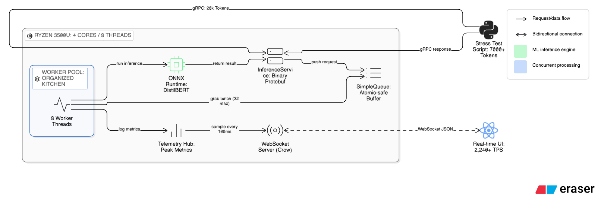
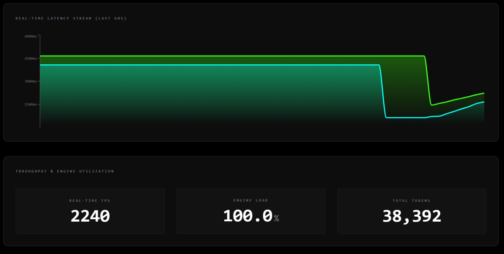
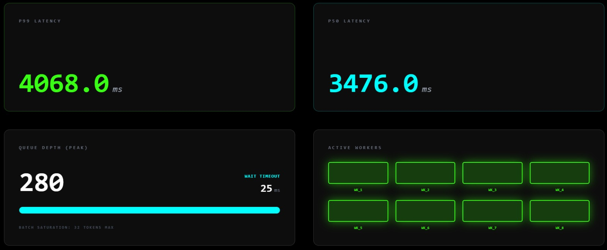
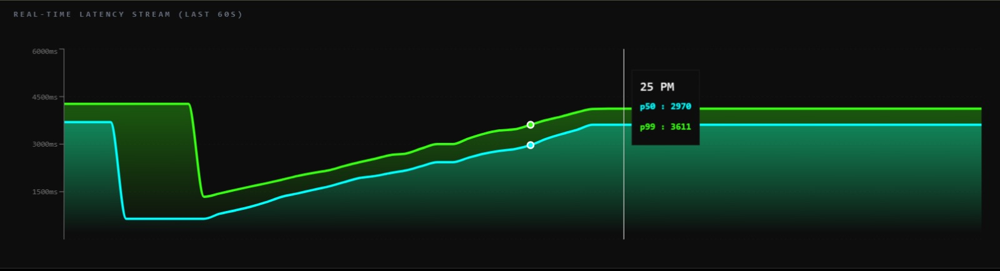
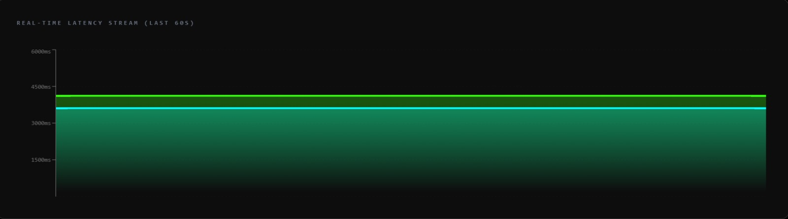

In current times, for running AI models, the NVIDIA H100 is a top-tier choice. It has almost 16,000+ CUDA cores, a huge 80 GB High Bandwidth Memory (HBM), and a raw computing power of around 10¹⁵ operations/sec or 1000+ TFLOPS.

I built my project on a 2019 HP 15 series with an AMD Ryzen 5 3500U processor with Radeon Vega 8. It has 8 threads with 8 GB DDR4 RAM, out of which 5.92 GB is usable. The aim was not to try and beat industry standards, but to squeeze the very best out of limited hardware by relying on batching, threading, and system design.

At their core, AI models are massive chains of linear algebra:

Matrix × Vector = Results

High-end GPUs use specialized cores to do this in parallel; I had to make my CPU threads do it as efficiently as possible given the constraints. In high-end systems, the GPU performs the math, ultra-fast VRAM stores the model, and thousands of operations run in parallel.

I attempted to work within these constraints by batching requests, using thread pools efficiently without causing race conditions, and optimizing CPU usage.

Large models need almost 16 GB, 32 GB, or even 80 GB just to load. In cases of insufficient RAM, the computer starts using the SSD, which is much slower than RAM. The focus was to operate the CPU at 100% to ensure calculations happen in the CPU itself.

Most AI uses Python as its primary language, and even though it has its positives, it uses a Global Interpreter Lock (GIL), which limits true parallel execution for CPU-bound tasks. Combined with garbage collection pauses, this can impact performance in high-throughput systems. On my laptop, C++ allows for maximum efficiency, letting me squeeze the maximum computation possible from my 4 Ryzen cores.

To make this work efficiently, I structured the system into multiple layers:

ARCHITECTURE DIAGRAM  

Section 2.1: The Communication Layer (gRPC)

In a standard AI setup,a REST API sending JSON data is more likely. While JSON is easy to debug, it’s "heavy." Every request requires the CPU to parse text strings into data the code can use—cycles I simply couldn't afford to waste on a 4-core Ryzen processor.

I chose gRPC because it treats a remote server method as if it were a local object. More importantly, it uses Protocol Buffers, a binary serialization format. Instead of "reading" sentences, my server receives a compact binary stream.

Here is the "Contract" I defined. Note I used repeated int32—this ensures the server receives pre-processed IDs, bypassing the need for a heavy string tokenizer on the backend:

Protocol Buffers

message InferenceRequest {
  repeated int32 tokens = 1; 
}

message InferenceResponse {
  repeated int32 output_tokens = 1;
}

This architecture means the data travels as a raw binary stream. The moment a packet hits the server, it’s ready for the math engine.

Section 2.2: The Orchestration Layer (Thread Pool)

Simple apps and low-traffic systems use a policy of "thread-per-request." But doing this on a Ryzen 3500U is difficult. Under heavy load, say 7000 requests, most of my already sparse CPU computation power would be used up on managing threads rather than focusing on the computation.

I used a thread pool consisting of 8 workers. Now why 8? Because my Ryzen 3500U has 4 physical cores and 8 logical threads, which roughly matches the maximum parallelism my CPU can handle.

//code 
unsigned int n = std::thread::hardware_concurrency();
std::cout << "Starting " << n << " worker threads." << std::endl;

ThreadPool pool(n, order_queue);
//code

Efficient wait and batching logic:

std::vector<InferenceRequest> requests = queue.pop_batch(32, 25);

The 32-Token Limit: Modern CPUs are most efficient when they do vectorized math. Processing 32 tokens at once allows the ONNX Runtime to leverage SIMD (Single Instruction, Multiple Data) instructions on the CPU. It’s significantly faster than running 1 token 32 separate times.

The 25ms Wait: If the server is under low load, we don't want the user waiting forever for a full batch. This acts as my latency ceiling. The worker will wait at most 25ms for more tokens to arrive; if they don't, it processes whatever is available and moves on.

This introduces a trade-off: higher throughput at the cost of slightly increased latency under load.

Non-Busy Waiting (Resource Efficiency)

Inside that pop_batch call is a std::condition_variable. This is the "Sleep/Wake" logic of the system.

If the queue is empty, the worker doesn't spin and waste CPU cycles asking if there's work. Instead, it enters a suspended state (sleeping). The moment gRPC pushes a new token into the queue, it notifies the variable, waking a worker up instantly.

This allows the system to go from 0% to 100% CPU utilization only when a burst of 7,000 tokens hits, and stay completely silent otherwise.
The Inference Layer: Architecture over Algorithm

The engine itself is model-agnostic. I used a generic `Ort::Session`, making the project reusable. DistilBERT was used as a "reference implementation", but the engine can be reused with a different model by simply changing the file path.

//code 
session = std::make_unique<Ort::Session>(env, L"C:\\Users\\wrich\\inference-server-cpp\\onnx\\model_quantized.onnx", session_options);
//code 

Choosing C++ wasn't just about language preference; it was about removing the 'Middleman' overhead found in most AI frameworks
Most Python AI libraries are built on top of C++ backends. Data is typically wrapped in Python objects (PyObject), which then need to be converted into native types before being passed to the underlying C++ engine. The results are then converted back into Python objects.

This abstraction is convenient, but it introduces overhead. Given my hardware constraints, I chose to bypass this layer entirely and work directly in C++, using native types (`int64_t`) and interacting directly with ONNX Runtime’s shared libraries (.dll / .so).

INT8 Quantization

A standard FP32 model is relatively heavy for my CPU, so I used an INT8-quantized version of DistilBERT. While this slightly reduces accuracy, it significantly reduces the model size from ~260 MB to ~67 MB.

CPUs are generally more efficient at integer operations than floating-point operations. Quantizing the model to INT8 helped it fit comfortably within the available 5.92 GB RAM and avoided spilling into SSD memory, which would have caused severe performance degradation.

This was a necessary trade-off: sacrificing a small amount of accuracy to make the system viable on constrained hardware.

By default, ONNX Runtime tries to utilize all available CPU cores by spawning its own internal threads.

In my case, I already had 8 worker threads. If ONNX Runtime also spawns its own threads, this leads to oversubscription — effectively creating `8 × n` threads competing for the same 8 CPU cores. This results in excessive context switching and degraded performance.

I used:

//code
ThreadPool(int num_threads, SimpleQueue<InferenceRequest>& q) : queue(q) {
    Ort::SessionOptions session_options;
    session_options.SetIntraOpNumThreads(1);
//code

This instructs ONNX Runtime to use a single thread per session, preventing it from spawning additional threads. This ensures that my thread pool remains in control of concurrency, allowing the CPU to focus on actual computation rather than thread management.

This resulted in stable and consistent ~100% CPU utilization under load.

The Telemetry Challenge: Capturing "Ghost" Metrics

One of the challenges I faced while building this inference engine was capturing metrics. Even after firing thousands of tokens, by the time I switched to the dashboard, the metrics were silent — 0 load, 0 active workers. The engine finished the work in milliseconds, faster than the browser could refresh the UI.

Some obvious fixes like `std::cout` logging or adding sleeps were not viable. These are I/O operations and significantly slower than CPU-bound token processing, effectively becoming the bottleneck themselves.

Using `std::mutex` for shared counters was also not ideal. Every time a worker finishes a task, it would need to acquire a lock to update the counter. If multiple workers finish simultaneously, they would queue up waiting for the lock. This leads to lock contention, which reduces parallel efficiency and hurts overall CPU utilization.

To solve this, I used `std::atomic`, which maps to hardware-level atomic instructions. The CPU itself has special instructions to perform operations like increment or swap in a single, uninterruptible step. This is the key difference between atomic operations and mutex-based locking — the entire Read-Modify-Write happens in one step at the hardware level.

Instead of tracking instantaneous ("current") values, I switched to tracking peak values within a time window. Instead of asking "How many workers are busy right now?", the system tracks "What was the maximum number of workers busy since the last check?"

This change turned the telemetry from "instant snapshots" into "windowed observations," making short bursts visible.

I used `compare_exchange_weak` to track the max queue depth and active worker peak.

The logic of CAS (Compare-And-Swap):

Read: "What’s the current peak?" (say 50)  
Compare: "Is my new value (75) greater than 50?"  
Swap: "If the value is still 50, update it to 75. If another thread already changed it, fail and return the new value."  
Loop: If it fails, retry with the updated value.

On some CPUs (like Ryzen 3500U), `compare_exchange_weak` can be slightly faster. It may fail spuriously due to hardware-level optimizations, but since it is inside a loop, it retries immediately.

//code 
int cur_peak = telemetry.active_worker_count_peak.load(std::memory_order_relaxed);
while (current_active > cur_peak && 
       !telemetry.active_worker_count_peak.compare_exchange_weak(
           cur_peak, current_active, std::memory_order_relaxed)) {}
//code

The `.exchange()` (The "Snapshot" Trick)

I used this in telemetry to send data to the dashboard. My dashboard requests the "Total Tasks Processed" every 100 ms. Simply reading the value and then resetting it to 0 can lead to lost updates due to race conditions.

The solution: `variable.exchange(0)`

This tells the hardware to return the current value and reset it to 0 in a single atomic operation, preventing other worker threads from updating the value in between. This provides an accurate snapshot of the 100 ms window.

Because it's one atomic step, no worker thread can sneak in a finished task in the middle. The dashboard gets a consistent snapshot of that time window.

//code
TelemetrySnapshot get_and_reset_telemetry() {
    return {
        telemetry.max_queue_depth.exchange(0, std::memory_order_relaxed),
        telemetry.tasks_processed.exchange(0, std::memory_order_relaxed),
        telemetry.active_worker_count_peak.exchange(0, std::memory_order_relaxed),
        telemetry.worker_active_time_ns.exchange(0, std::memory_order_relaxed)
    };
}
//code
I used std::memory_order_relaxed because these are independent counters.  the overhead of strict memory synchronization between threads is not necessary here  here; all the counts for is the  hardware-level atomic update to be fast.
Results & Benchmarks:
The engine was stress tested with a sustained burst of tokens (around 7000tokens/burst at its peak). demonstrating stable performance .

*Figure 1: Real-time dashboard showing 2,240 TPS and 100% CPU saturation on a Ryzen 3500U.*

With the architecture set and the telemetry active, I pushed the engine to its limit. The goal wasn't just to see if it worked, but to see how much I could squeeze out of my hardware.

The "Perfect" 100% Load

The most rewarding part of this project was seeing the Engine Load hit a rock-solid 100.0%. In many systems, CPU usage often peaks around 70–80% because the software isn't efficient enough to fully utilize the hardware.

The fact that it stayed at 100% proves:

Zero I/O Bottlenecks: The gRPC binary stream and Protobuf serialization provided data fast enough that the CPU remained the bottleneck.

No Thread Contention: My decision to use a fixed pool of 8 workers (matching the Ryzen 3500U's logical threads) ensured the CPU spent its time on computation, not on managing thread context switches.

Throughput: 2,240 Tokens Per Second

This throughput was achieved by leveraging INT8 Quantization and batching. By grouping 32 tokens into a single inference pass, the engine maximized the CPU's vector instructions.

This wasn't a single, lucky burst. I put the system through multiple sustained stress tests, varying the token counts—sending 7,000 tokens in one go, followed by smaller, rapid-fire batches. In total, the engine processed 38,392 tokens across these varied bursts. This tested the SimpleQueue’s ability to handle backpressure and the batcher’s ability to regroup tokens into efficient 32-count blocks on the fly.

Despite the 5.92 GB RAM limitation, there was zero paging to the SSD. The entire model remained resident in memory, allowing for consistent, high-velocity inference that would be difficult to achieve in a typical high-level Python setup without similar optimizations.

At this point, the system was no longer I/O-bound or thread-bound — it was purely compute-bound.

Metrics

100% hardware saturation with all 8 logical cores pinned and the SimpleQueue safely buffering large batch backlogs during peak load.

Visualizing the "Ramp-up": As the engine hits 100% hardware utilization, the P99 tail latency remains close to the median, verifying that the lock-free telemetry is capturing raw hardware performance without overhead.

Steady-state equilibrium: The flat-lined latency distribution confirms stable performance under sustained 100% CPU load.
This project wasn’t about competing with high-end GPUs, but about understanding and pushing system-level performance within tight hardware constraints.